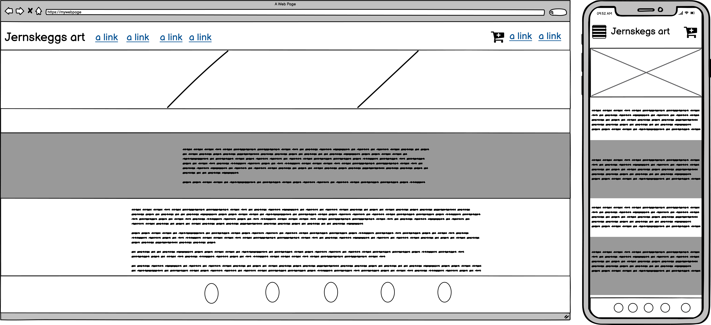
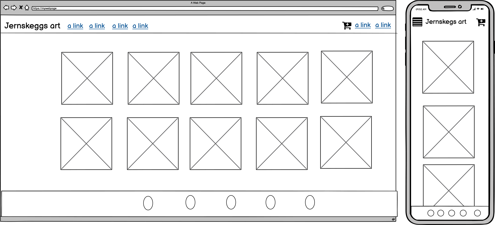
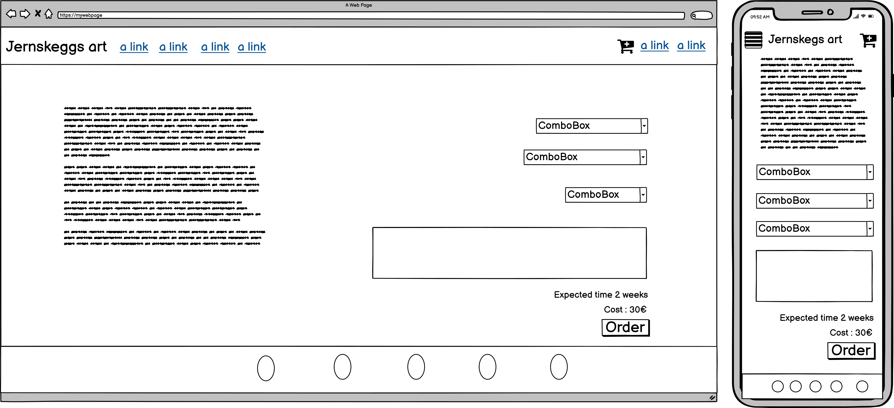
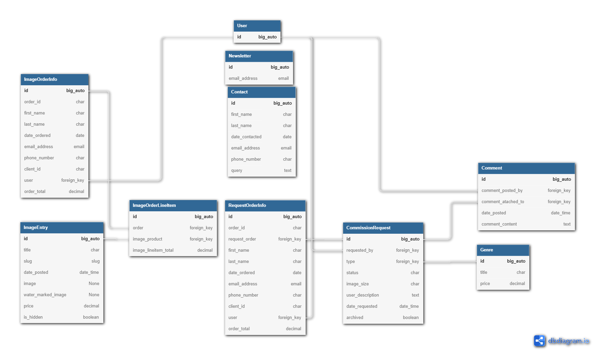

Casper Hille

Full-Stack Development course (5p) | Portfolio project 5 (E-Commerce focused project)
---

# Purpose of the Project

The project aims to make an e-commerce webpage with an authorization system and payment methods

The page was built to sell my art and make me available for people to make requests or commissions in the art community.
# Design, planning and Wireframes

## User Stories

  Using a Kanban board, I will use Agile development to work on one user story at a time.

  - [USER STORY: go to inquiries #1](https://github.com/Jernskegg/Jernskegs-art/issues/1): As an Admin, I can go to inquiries so that I can fulfil users' inquiries
  - [USER STORY: disable a user #2](https://github.com/Jernskegg/Jernskegs-art/issues/2): As an Admin, I can disable a user so that I can prevent users from accessing the page after they have broken terms of service
  - [USER STORY: create product post #4](https://github.com/Jernskegg/Jernskegs-art/issues/4): As an Admin, I can create product post so that I can create a new product
  - [USER STORY: Set price #5](https://github.com/Jernskegg/Jernskegs-art/issues/5): As an Admin, I can set price so that I can set what price to sell my product at
  - [USER STORY: upload image #6](https://github.com/Jernskegg/Jernskegs-art/issues/6): As an Admin, I can upload an image so that I can set what is set to be sold
  - [USER STORY: Delete an image #7](https://github.com/Jernskegg/Jernskegs-art/issues/7): As an Admin, I can Delete an image so that I can remove an Image I don't want to be sold anymore
  - [USER STORY: look at the gallery #8](https://github.com/Jernskegg/Jernskegs-art/issues/8): As a user, I can look at the gallery so that I can browse for designs
  - [USER STORY: add an item to my shopping cart #9](https://github.com/Jernskegg/Jernskegs-art/issues/9): As a User, I can add an item to my shopping cart so that I can buy can see the price combined and buy them all in one go
  - [USER STORY: add an inquiry #10](https://github.com/Jernskegg/Jernskegs-art/issues/10): As a User, I can add a request so that I can buy a graphic design that fits my purpose
  - [USER STORY: subscribe to the gallery #11](https://github.com/Jernskegg/Jernskegs-art/issues/11): As a User, I can subscribe to the gallery so that I can be notified when new art is being posted
  - [USER STORY: go to purchase history #12](https://github.com/Jernskegg/Jernskegs-art/issues/12): As a User, I can go to purchase history so that I can watch the status on my inquiry
  - [USER STORY: change my profile #13](https://github.com/Jernskegg/Jernskegs-art/issues/13): As a User, I can **change my profile ** so that I can keep my contact details updated
  - [USER STORY: order(filter) the products #14](https://github.com/Jernskegg/Jernskegs-art/issues/14): As a User, I can order(filter) the products so that I can more easily find what I need
  - [USER STORY: make an account #15](https://github.com/Jernskegg/Jernskegs-art/issues/15): As a User, I can make an account so that I can the ability purchase products
  - [USER STORY: change my password #16](https://github.com/Jernskegg/Jernskegs-art/issues/16): As a User, I can change my password so that I can keep my account secured
  - [USER STORY: go to purchased items #17](https://github.com/Jernskegg/Jernskegs-art/issues/17): As a User, I will get an email so that I can download the art, that I have bought

## Admin panel userstories

  - [USER STORY: AP View requests #28](https://github.com/Jernskegg/Jernskegs-art/issues/28): As an admin/site owner, I can view requests so that I can fulfil a users order
  - [USER STORY: AP add a product #27](https://github.com/Jernskegg/Jernskegs-art/issues/27): As an Admin, I can add a product so that I can add a new product easily to be able to sell it
  - [USER STORY: AP Delete an image #26](https://github.com/Jernskegg/Jernskegs-art/issues/26): As an Admin, I can Delete an image so that I can remove an Image I don't want to be sold anymore
  - [USER STORY: AP adjust price #25](https://github.com/Jernskegg/Jernskegs-art/issues/25): As an Owner/admin, I can adjust prices so that that I can increase/decrease prices to increase sales

## Rough sketch

## UX design
  - logo is a simple text logo, Different font might be feasible here
  - Stay on the page navbar, Using multiple smaller pages does not require that much scrolling so I don't see the need to add a sticky navbar or use a scroll spy to display a secondary navbar
  - stay at bottom of the page footer, the Same reasoning here these pages do not require a huge amount of scrolling so you'll find the footer after one or two scrolls.
  - Colour palette chosen for this page is black, white and orange, Since Jernskegg means Ironbread and the oxidized iron looks orange, black and white are just neutral colours that fit with anything but dominantly I've used black and white. This page will feature diverse pictures in the gallery so using black and white the most will make the colours of the images pop out slightly more.

## Database relations

## Data model

# Features

  ## Gallery

  the webpage uses a database and accesses it, displays the database entries as a repeatable template and Bootstrap popup

  ## Shop

  From the gallery, you can purchase items using stripe as a secure payment method

  ## Request

  the webpage has a request feature where the user is allowed to request more personalized images/artwork

  ##  E-commerce Admin panel

 In the Admin panel, you can adjust the price, name, and Change the visibility of a product or delete an image.

  ## python

  Python is an easy and basic programming language, but it is powerful with libraries to bring out capabilities to use for multiple purposes

  ## Django Framework

  Django is a framework that is made to speed up the process of building web applications, Here you can make apps and then use the apps for different projects. it has extensive documentation.

  It is like all on in framework or "Batteries included philosophy framework"

# Future features

  ## Request

  I have planned to add user feedback and a chat system per order so that the Admin and user can have a feedback loop going, To ensure the Customer is fully satisfied with the result

  ## E-commerce Admin panel

  add the Cloudinary file to allow changing the existing picture instead of having to add a new product

# Bussiness model

  My idea is to sell art to private customers and people who want art they could print out and hang at home, have as a desktop wallpaper.

  Businesses can also make a request but this service is aimed at private customers, so mainly B2C 

  The target audience is pretty big but niched, Mostly people who play games there are a lot of requests for artwork on communities on Facebook "World of Warcraft" group or forums, so using Googles/Facebook ads on those pages would increase webpage traffic, Facebook groups are commonly used for art commission so announcing the existence in communities would also increase webpage traffic.

  one market strategy would be to build a customer base. So have left requests for free which if they are satisfied they would willing to come back and tell their friends or recommend the business services.

 ## Facebook page
 I have created a Facebook page if for any reason the link is dead I've attached a [screenshot](docs/images/facebook.png) of the page. 

# testing

  ## code validation

  - W3C HTML validated, No errors
  - JShint Validated. 1 warning "Stripe variable undefined", Disregarding this because this - variable is being used by Stripes main JS
  - Jigsaw CSS validated, No errors
  - Pep8 validated, No errors except for Generated files,

  ## Responsive tests

  I am going to check all pages and test them through Google developer tools using the Device toolbar and set it to different models of tablets and phones.

  - ## Nexus 5
    
  - ## Galaxy Note II

  - ## Ipad Pro
  
  - ## Iphone 6/7/8 plus

  ## Automated testing

  - ## File checker
     in the admin panel made a custom function to test for file format, And to ensure my function worked I've made tests accordingly and designed it after the tests

  ## User Story testing

  In this testing phase, I will go manually test all [user stories](#user-stories) to ensure they work as intended.

  all steps taken below start from a fresh start(incognito mode and logged out) and start on the landing page

  - [USER STORY: go to inquiries #1](https://github.com/Jernskegg/Jernskegs-art/issues/1):

    Result: **Works as intended**
    
    Steps taken:

    1. I browsed to /admin/
    2. I logged in using the admin credentials
    3. clicked on the Commision>comission requests tab on the left
    4. here I see the list of work I have ahead of me

    Notes: I have made an admin panel to make this easier
    
  - [USER STORY: disable a user #2](https://github.com/Jernskegg/Jernskegs-art/issues/2):
     
    Result: **Works as intended**
    
    Steps taken:

    1. I made an account called "BanMe"
    2. log out of "BanME"
    3. I clicked the "Create an account / login" link on the top right of the page
    4. I logged in using the admin credentials
    5. clicked the admin panel link on the top right
    6. clicked the Advanced Admin Panel on the bottom left
    7. clicked on users
    8. searched for the username "BanMe" I want to "Suspend" in the search bar
    9. clicked on the profile
    10. scrolled down to "Active status" and unclicked it
    11. Logged out and tried logging in with "BanME"
    12. User "BanMe" cannot log in

    Notes:

  - [USER STORY: create product post #4](https://github.com/Jernskegg/Jernskegs-art/issues/4):
    
    Result: **Works as intended**
    
    Steps taken:

    1. I browsed to /admin/
    2. I logged in using the admin credentials
    3. clicked on product entries in the left menu.
    4. clicked "add product button" top right of the page
    5. filled in only the title and price and tried saving, this gave me a validation error which is expected
    6. filled all the required fields and the product is saved
    7. clicked view site in the top right
    8. went to the gallery, and the product is visible

    Notes:
    
  - [USER STORY: Set price #5](https://github.com/Jernskegg/Jernskegs-art/issues/5):
    
    Result: **Works as intended**
    
    Steps taken:
    1. I browsed to /admin/
    2. I logged in using the admin credentials
    3. clicked on product entries in the left menu.
    4. Clicked on the product I want to edit the price on
    5. updated the price field and saved
    6. clicked view site in the top right
    7. went to the gallery, and changes are visible
  
    Notes:
   
  - [USER STORY: upload image #6](https://github.com/Jernskegg/Jernskegs-art/issues/6):
    
    Result: **Works as intended**
    
    Steps taken:
    1. I browsed to /admin/
    2. I logged in using the admin credentials
    3. clicked on product entries in the left menu.
    4. Clicked on the product I want to edit the price on
    5. updated the images fields and saved
    6. clicked view site in the top right
    7. went to the gallery, and changes are visible

    Notes:
    
  - [USER STORY: Delete an image #7](https://github.com/Jernskegg/Jernskegs-art/issues/7):
    
    Result: **Works as intended**
    
    Steps taken:
    1. I browsed to /admin/
    2. I logged in using the admin credentials
    3. clicked on product entries in the left menu.
    4. Clicked on the product I want to edit the price on
    5. pressed delete
    6. clicked view site in the top right
    7. went to the gallery, and the image is gone

    alternative:
    1. I browsed to /admin/
    2. I logged in using the admin credentials
    3. clicked on product entries in the left menu.
    4. Clicked on the product I want to edit the price on
    5. pressed the "*is hidden*" checkbox and saved
    6. clicked view site in the top right
    7. went to the gallery, and the image is gone
    
    Notes:
    
  - [USER STORY: look at the gallery #8](https://github.com/Jernskegg/Jernskegs-art/issues/8):
    
    Result: **Works as intended**
    
    Steps taken:
    1. Click the gallery link
    2. images are visible and clickable

    Notes: UX design for the fullscreen image is still suboptimal
    
  - [USER STORY: add an item to my shopping cart #9](https://github.com/Jernskegg/Jernskegs-art/issues/9):
  
    Result: **Works as intended**
    
    Steps taken:
    1. Click the gallery link
    2. click on the image I want to add
    3. clicked on the add to basket in the bottom right.
    4. I get returned to the gallery and press the cart icon top right.
    5. here I can see all the items in my cart

    Notes: Adding an add to cart button on the image could promote positive UX design

  - [USER STORY: add an inquiry #10](https://github.com/Jernskegg/Jernskegs-art/issues/10):
  
    Result: **Issues found:** Sign up link not working when not logged in
    Fix: Link has had the wrong redirect, updated to it the correct link and now works as intended
    
    Steps taken:
    1. Clicked on the requested link
    2. I get told to log in, I press sign up -> Does not work
    3. I press log in and get redirected to the login page.
    4. I log in and click on the request button
    5. I fill in half the form, get a validation error as expected
    6. fill every required filed
    7. I get redirected to my account where the request is visible with the status of the request
   
    Steps taken after the fix:
    1. Clicked on the request link
    2. I get told to log in, I press sign up -> it now works

    Notes:

  - [USER STORY: subscribe to the gallery #11](https://github.com/Jernskegg/Jernskegs-art/issues/11):
  
    Result: **Works as intended**
    
    Steps taken:
    1. I scroll down to the footer and fill in my email and press sign up

    Notes: Adding a message that tells if it is successful or not would improve the user experience
    
  - [USER STORY: go to purchase history #12](https://github.com/Jernskegg/Jernskegs-art/issues/12):
    
    Result: **Works as intended**
    
    Steps taken:
    1. I click "Create an account/Login" link
    2. I log into my account
    3. I click my account
    4. my request is visible and I can see the status

    Notes: The download links should be attached to the request text field when it is done
    
  - [USER STORY: change my profile #13](https://github.com/Jernskegg/Jernskegs-art/issues/13):
    
    Result: **Works as intended**
    
    Steps taken:
    1. I click "Create an account/Login" link
    2. I log into my account
    3. I click my account
    4. I click change my email
    5. I fill in the textbox
    6. press add E-mail
    7. I get an email to verify
    8. I verify the email
    9. make my new mail the primary mail
    10. select the old e-mail and press remove
    
    Notes:

  - [USER STORY: order(filter) the products #14](https://github.com/Jernskegg/Jernskegs-art/issues/14):
    
    Result: **Works as intended**
    
    Steps taken:
    1. Click the gallery link
    2. press on the "sort by newest" and I see the newest first
    3. press on the Sort by price"  and I see the cheapest first
    4. press on the "Sort by name" and I see images ordered by alphabet
    
    Notes:
    
  - [USER STORY: make an account #15](https://github.com/Jernskegg/Jernskegs-art/issues/15):
    
    Result: **Works as intended**
    
    Steps taken:
    1. I click "Create an account/Login" link
    2. press the SignUp link
    3. fill half form, get a validation error as expected
    4. fill in the required fields
    5. I get an email to verify my email, I verified
    6. I am now logged in
    
    Notes:
    
  - [USER STORY: change my password #16](https://github.com/Jernskegg/Jernskegs-art/issues/16):
    
    Result: **Works as intended**
    
    Steps taken:
    1. I click "Create an account/Login" link
    2. I log into my account
    3. I click my account link
    4. click the "Change my password"
    5. fill in the form
    6. logged out
    7. logged in to verify the password is changed
    
    Notes:
    
  - [USER STORY: go to purchased items #17](https://github.com/Jernskegg/Jernskegs-art/issues/17):
    
    Result: **Works as intended**
    
    Steps taken:
    1. Click the gallery link
    2. click on the image I want to add
    3. clicked on the add to basket in the bottom right.
    4. I get returned to the gallery and press the cart icon top right.
    5. here I can see all the items in my cart
    6. I press on checkout
    7. fill in the form incorrectly, I get validation errors as expected
    8. I fill in all required fields
    9. I get redirected to the purchase successful page with the message a mail has been sent to my email
    10. I open my email and see the items I have purchased without watermarking
    
    Notes:

## Admin panel userstories

  All these tests start from the overview in the e-commerce admin panel logged into a staff account.

  log in to your staff account like you would log in as any account in the "Create an account/login" link

  This is accessed by having a staff account and clicking the top right button "admin panel" or browsing to /adminpanel/ but that requires you to be logged into a staff account otherwise you'll get redirected to the landing page. 

  - [USER STORY: AP View requests #28](https://github.com/Jernskegg/Jernskegs-art/issues/28):
    
    Result: **Issues found:** Shows no request on request page but does in the overview tab
    Fix: The Django HTML tag was pointing to the wrong context, I've corrected this and now works as intended
    
  - [USER STORY: AP add a product #27](https://github.com/Jernskegg/Jernskegs-art/issues/27):
    
    Result: **Works as intended**

    Steps taken:
    1. I click the products button on the left
    2. in the top left of the page I click the "Add a new image" button
    3. fill in the required fields
    4. I get redirected to the products page, I can now see my new product
    5. I browse to the gallery and see my new product listed (if hidden is not checked)

    Notes:

  - [USER STORY: AP Delete an image #26](https://github.com/Jernskegg/Jernskegs-art/issues/26):
    
    Result: **Works as intended**

    Steps taken:
    1. I click the products button on the left
    2. I click on the delete button on the corresponding line
    3. the image is removed from the products
    4. browse to the gallery and the image is not visible

    alternative:
    1. I click the products button on the left
    2. I check the hidden checkbox
    3. I press save
    4. my changes are reflected in the product list
    5. gallery the image is not visible when the checkbox is checked
    
    Notes:
    
  - [USER STORY: AP adjust price #25](https://github.com/Jernskegg/Jernskegs-art/issues/25):
    
    Result: **Works as intended**

    Steps taken:
    1. I click the products button on the left
    2. I changed the number field
    3. I press save
    4. my changes are reflected on the products page
    5. I browse the gallery
    6. my changes are reflected in the image

      Notes:
      
# Deployment

## via Heroku

- Before you deploy, ensure your requirements.txt is updated and accounted for and get your API keys ready. I have Attached a Example.Env.py with instructions in it

- to deploy an application through Heroku, you need to make an account. Once you have created an account, you can have up to 5 projects on the free plan.

- To create a new app. Log in, and you'll see a "Create app" button.
  Once pressed, you'll be able to name your project and choose which region your application will host. The name needs to be unique.

- You'll need to set up all your setting before you can deploy your project. You can find the “setting” in the tabs in the dashboard.

  If you have API keys, you can insert them in the Config Vars section, and there is a button to reveal the keys.
  once clicked, the const you used in the project should be in "KEY" and creds.json in the "VALUE"

  Next, we'll set up build packs. Press the build pack and add the build packs you need. If you need more than one, make sure you put them in the correct order, You can drag and drop their list items.

- now, we can start the deployment by heading over to the deploy tab. in this project, I chose to deploy through GitHub.

  After I clicked through GitHub, I had to connect Heroku to my GitHub account. Thereafter I had to search for my project. Once selected.
  I could choose which branch.

  Now I can select an automatic deployment, which updates the app once GitHub updates or a manual deployment that will only update Heroku when I press that button again.

  Now we'll wait for Heroku to download all plugins and install all the requirements. Once done, there will be a message telling it is completed or failed. Once successful, it will show a button to view your deployed application.

- Now you have your deployed page. Now you can test if everything works as it should or send the links to your friends to show off those accomplishments you have made.

# Credits

  Some parts of the checkout have been taken from Stripes docs.
  checkout and cart app was coded along with Boutique-ado from Code Institute, Some similarities may occur and those credits go to Code institute
